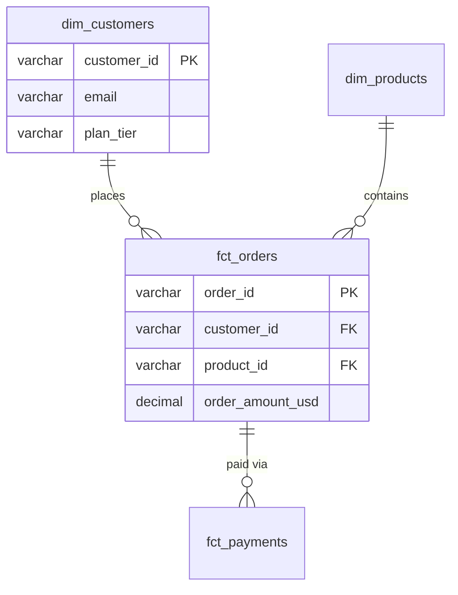

# Design Review: [Feature/Model Name]

**Date:** YYYY-MM-DD
**Author:** [name]
**Reviewers:** [names]
**Status:** draft | in-review | approved | implemented
**Related issue:** [GH-XX / JIRA-XX]

---

## 1. Problem Statement

What business question or capability are we building? Who asked for it and why?

<!-- HINT: Link to the original request — Slack thread, ticket, etc.
     Be specific: "Marketing needs weekly cohort retention by signup channel"
     not "Marketing needs a retention report" -->

## 2. Current State

What exists today? What models/tables are involved? What's the gap?

```
Current lineage:
src_app__events → stg_app__events → ??? (gap) → dashboard
```

<!-- HINT: Use sqlprism to generate current lineage:
     sqlprism query "show lineage for <table>" -->

## 3. Proposed Design

### 3.1 Entity Relationship



<!-- HINT: Replace with your actual models.
     This renders natively in GitHub, VS Code (with extension), and
     can be exported to PNG: mmdc -i design-review.md -o diagram.png
     See agents/templates/diagrams/ for more examples. -->

### 3.2 New/Modified Models

| Model | Layer | Grain | Materialization | Source |
|-------|-------|-------|-----------------|--------|
| `stg_app__events` | staging | `event_id` | view | Modified |
| `int_events__sessionized` | intermediate | `session_id` | ephemeral | New |
| `fct_sessions` | fact | `session_id` | incremental | New |

### 3.3 Key Columns

| Model | Column | Type | Description |
|-------|--------|------|-------------|
| `fct_sessions` | `session_id` | varchar | PK, surrogate |
| `fct_sessions` | `customer_id` | varchar | FK → dim_customers |
| `fct_sessions` | `started_at` | timestamp | Session start |
| `fct_sessions` | `event_count` | integer | Events in session |

### 3.4 Business Logic

Document the non-obvious decisions:

- Sessionization window: **30 minutes** of inactivity = new session
- Attribution: **last-touch** for channel assignment
- Timezone: all timestamps in **UTC**, date dimensions in **org timezone**

<!-- HINT: This section is where most bugs originate. Be explicit about
     edge cases: What happens with null values? How do you handle
     late-arriving data? What's the dedup strategy? -->

## 4. SCD Strategy

| Entity | Strategy | Reason |
|--------|----------|--------|
| `dim_customers` | Type 2 | Need to track plan changes over time |
| `dim_products` | Type 1 | Product attributes are corrective, not historical |

<!-- HINT: Default to Type 1 unless there's a documented business need
     for history. Every Type 2 adds complexity. -->

## 5. Impact Analysis

### Downstream dependencies (what this changes)

<!-- HINT: Run sqlprism to check:
     sqlprism query "show downstream of <table>" -->

| Existing Model | Impact | Action Needed |
|----------------|--------|---------------|
| `mrt_revenue__monthly` | Column rename | Update reference |
| `dashboard_x` | New column available | Notify BI team |

### Breaking changes
- [ ] Column renames (list them)
- [ ] Type changes (list them)
- [ ] Grain changes (list them)
- [ ] Removed columns (list them)

## 6. Testing Plan

| Test | Type | Threshold |
|------|------|-----------|
| `fct_sessions.session_id` unique | schema | — |
| `fct_sessions.session_id` not_null | schema | — |
| `fct_sessions` row count vs source events | data | ±5% |
| `fct_sessions.started_at` freshness | freshness | warn 4h, error 12h |
| `fct_sessions` sessionization accuracy | custom | spot-check 100 sessions |

## 7. Rollout Plan

- [ ] Develop in `dev` target
- [ ] Peer review (this doc + code)
- [ ] Run in `staging` with production data
- [ ] Validate against existing reports (if replacing)
- [ ] Deploy to `prod`
- [ ] Notify downstream consumers
- [ ] Monitor for 1 week

## 8. Open Questions

- [ ] [question for reviewer]

<!-- HINT: Don't resolve these yourself — tag them for specific people.
     "Is 30-minute sessionization window correct? @product-lead" -->
